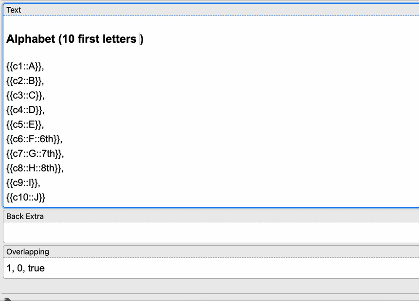

# Simple Cloze Overlapper template for Anki 2.1 (probably any version, as it's JavaScript-only)

Hey 👋

I got a bit confused with the original [Cloze Overlapper](https://github.com/glutanimate/cloze-overlapper), and it felt a bit wrong to keep redundant information in our collections. The author also [keeps updates for Anki 2.1 behind a paywall](https://github.com/glutanimate/cloze-overlapper/issues/42#issuecomment-675031109).

Here is a pure JavaScript version that you can paste into your card templates:
* the front side is in [front.html](front.html),
* the back side is in [back.html](back.html).

It has been tested to work on Anki (desktop), and AnkiDroid. I assume it should work everywhere indefinitely, as it's written in JavaScript only.

I hope the recording will be self-explanatory! The last two modes seem odd to me, but they were trivial to add, maybe someone will find them useful.

Reddit thread: https://old.reddit.com/r/Anki/comments/116nky2/simple_cloze_overlapper_template_for_anki_21/

## Setup

1. Click Tools → Manage Note Types.
2. Click Add → Add: Cloze.
3. Give it a name, like “Cloze Overlapper”.
4. Click Fields → Add.
5. Name the field “Overlapping”.
6. Click Save → Cards.
7. Replace the text in the Front Template with the text from [`front.html`](front.html).
8. Click Back Template, replace the text with the text from [`back.html`](back.html).
9. Click Save.

## Options (per note)

A good idea is to create a new note type (based on Cloze), e.g. “Cloze (overlapping)”, copy the front and back templates from here, and add a new field to it to control the behavior per each note. The templates below assume that the field will be called “Overlapping”.

The options (separated by space, comma, pipe, etc.) are:

1. (default: `1`) The number of leading clozes to uncover.
2. (default: `0`) The number of following clozes.
3. (default: `true`) Whether to show all clozes – set to false to omit them, e.g. for long lyrics/poems.
4. (default: `false`) Whether to reveal all clozes on the back (the ones we didn't ask for).
5. (default: `false`) Whether to reveal all user-defined hints (placeholders).
6. (default: `1`) How many clozes to ask for on a single card, e.g. Wozniak [suggests 3 per question in his (synthetic) alphabet example](https://super-memory.com/articles/20rules.htm#Enumerations).

## Card asking for all clozes

If you need an extra card that asks you for all the clozes at once, add another cloze with an unused number and `ask-all` in its content. E.g. `{{c99::ask-all}}` – as in the recording (thanks to `/u/Spiritual_Issue7174`).
